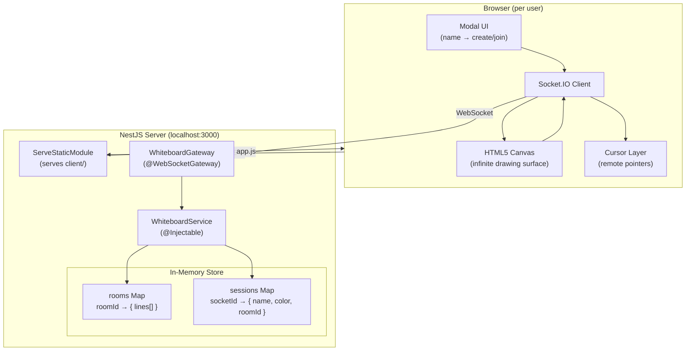

# CoBoard — Realtime Collaborative Whiteboard

A collaborative drawing app where multiple users share an infinite canvas, see each other's collaborations in real time.

---

## (MVP) Features

- **Whiteboard Rooms** — Create a room and share the 6-digit ID, or join one by ID
- **Infinite Canvas** — Pan (middle-mouse drag, space+drag, two-finger scroll) and zoom (ctrl+wheel / trackpad pinch) freely
- **Freehand Drawing** — Smooth pencil strokes synced instantly to every participant
- **Undo / Redo** — Per-user stroke history (Cmd/Ctrl+Z, Cmd/Ctrl+Shift+Z) with live broadcast to collaborators
- **State Replay** — Late joiners receive the full drawing history
- **Clear Canvas** — Wipes the board for everyone in the room.

---

## Tech Stack

| Layer | Technology |
|---|---|
| Frontend (Vibecode) | Vanilla HTML, CSS, JavaScript, Canvas API |
| Backend | NestJS (Node.js), Socket.IO v4 |
| Transport | WebSocket (with long-polling fallback) |
| Static files | `@nestjs/serve-static` |

---

## Getting Started

**Prerequisites:** Node.js v18+

```bash
cd backend
npm install
npm run build
npm run start:prod
```

Open http://localhost:3000 in two browser tabs to test collaboration.

For development with auto-restart on file changes:

```bash
cd backend
npm run start:dev
```

---

## System Components Architecture


---

Updated version of previous [version](https://github.com/sanketmp/realtime-whiteboard)